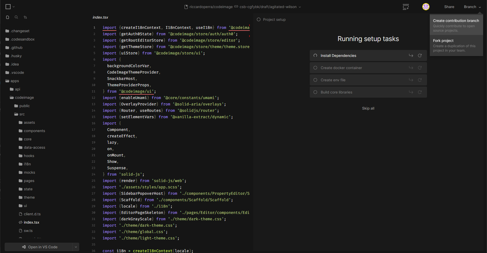

# Contributing

> Thank you for considering contributing to this project. Your help is very much appreciated!

When contributing, it's better to first discuss the change you wish to make via issue or discussion, or any other method
with the owners of this repository before making a change.

All members of our community are expected to follow our [Code of Conduct](CODE_OF_CONDUCT.md). Please make sure you are
welcoming and friendly in all of our spaces.

## Requirements

> **Note** Due to the recent release, the modalities of contribution could change during the time.

In order to contribute and start the project locally, you can follow these 2 guides:

- [Run on your machine](#run-on-your-machine)
- [Run on CodeSandbox Projects without having to install and run the project locally](#run-on-codesandbox-projects)

## Run on your machine

### Cloning the repository

To start contributing to the project, you have to fork this repository and clone it to your local machine:

```bash
git clone https://github.com/YOUR_USERNAME/codeimage.git
```

### Installing Node.js and pnpm

This repository uses [pnpm](https://pnpm.io/it/) to manage multiple projects. You need to install **pnpm 7 or higher**
and **Node.js v16 or higher**.

You can run the following commands in your terminal to check your local Node.js and npm versions:

```bash
node -v
pnpm -v
```

### Installing dependencies

Once in the project's root directory, you can run the following command to install the project's dependencies:

```bash
pnpm install
```

### Creating a new branch

Make sure you create a new branch for your changes. You can do this by running the following command in your terminal:

```bash
git checkout -b feat/my-feature
```

### Preparing the environment

In order to prepare your environment correctly, you need to have `Docker` installed in your machine to launch the
docker-compose.

```bash
docker-compose -f apps/api/docker-compose.dev.yml -p codeimage up -d
```

As soon as the containers are all ready, you can launch the `prepare:env` script to configure your environment variables automatically.

```bash
pnpm prepare:env
```

It is a small cli that will guide you to the correct configuration.

> **WARNING** Be sure to enable the Auth0 mock if you don't have a properly configured account with environment variables.

After configuring everything Prisma migrations will be launched to generate the types.

### Starting the development server

After your environment is configured, you can run the following command to start the development server:

```bash
pnpm libs:build # Build dependent libraries
pnpm app:dev
```

Now you can open http://localhost:4200 in your browser to see the project's site.

You can access the API backend server through `http://localhost:3000`

## Run on Codesandbox Projects

You will be able to access the Project repository through this link:

https://codesandbox.io/p/github/riccardoperra/codeimage


*Preview of CodeSandbox projects with Fork action*

[You don't know CodeSandbox Projects?](https://codesandbox.io/post/announcing-codesandbox-projects)

[CodeSandbox Docs](https://codesandbox.io/docs/projects/learn/introduction/overview)

### Pull Request Process

1. We follow [Conventional Commits](https://www.conventionalcommits.org/en/v1.0.0-beta.4/) in our commit messages, i.e.
   `feat(core): improve typing`
2. Make sure you cover all code changes with unit tests
3. When you are ready, create Pull Request of your fork into original repository
