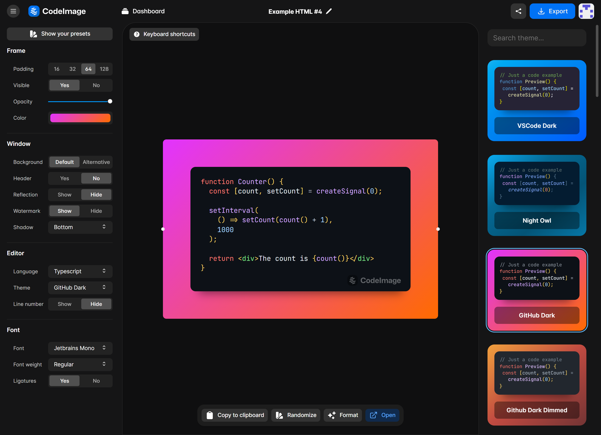

> Create elegant code screenshots of your source code.

## Introduction

[CodeImage](https://codeimage.dev) is the newest tool to help developers to create beautiful screenshots of their code,
providing several
features to speed up the process to post in social media.

## 🤖 Tech stack

CodeImage architecture consist of a PNPM monorepo, currently subdivided in `packages` and `apps`.

### Apps

#### [@codeimage/app](./apps/codeimage)

The front-end application, entirely built with SolidJS.

It currently also relies on these libraries:

- [vanilla-extract](https://github.com/seek-oss/vanilla-extract): Zero-runtime Stylesheets-in-TypeScript.
- [CodeMirror6](https://codemirror.net/6/): Extensible code editor
- [solid-aria](https://github.com/solidjs-community/solid-aria): High-quality primitives that help to build accessible
  user interfaces
- [solid-primitives](https://github.com/solidjs-community/solid-primitives): SolidJS primitives library

#### [@codeimage/api](./apps/api)

The REST API layer built with [Fastify](https://github.com/fastify/fastify),
[Prisma ORM](https://github.com/prisma/prisma) and [Auth0](https://auth0.com/).

### Packages

- [@codeimage/ui](./packages/ui): contains the source code of the UI kit of CodeImage front-end application
- [@codeimage/config](./packages/config): contains the base configurations and interfaces for CodeImage
- [@codeimage/highlight](./packages/highlight): contains the custom editor and highlighting themes for CodeMirror

- [@codeimage/dom-export](./packages/dom-export): contains the [html-to-image](https://github.com/bubkoo/html-to-image)
  fork which includes several fix for image export
- [@codeimage/locale](./packages/locale): contains a wrapper
  of [@solid-primitives/i18n](https://github.com/solidjs-community/solid-primitives/tree/main/packages/i18n) which
  includes strict typing for i18n
- [@codeimage/vanilla-extract](./packages/vanilla-extract): contain
  the [Vanilla Extract](https://github.com/seek-oss/vanilla-extract) plugin fork which includes SolidJS and PNPM fixes
  to work under monorepo.
- [@codeimage/prisma-models](./packages/prisma-models): contains the Prisma ORM backend models shared across front-end
  and back-end application.
- [@codeimage/atomic-state](./packages/atomic-state): contain the source code of a small state manager which includes
  some utilities helper for RxJS and solid-js/store

## 🌏 Contributions

> **Warning** **Read this before opening any PR!**

When contributing, it's better to first discuss the change you wish to make via issue or discussion, or any other method
with the owners of this repository before making a change.

See the [CONTRIBUTING.md](./CONTRIBUTING.md) guide for more details.

---

  

  CodeImage is the winner of <a href="https://hack.solidjs.com">SolidHack 2022</a> for the Best Application category!

## License

MIT © [Riccardo Perra](https://github.com/riccardoperra)
