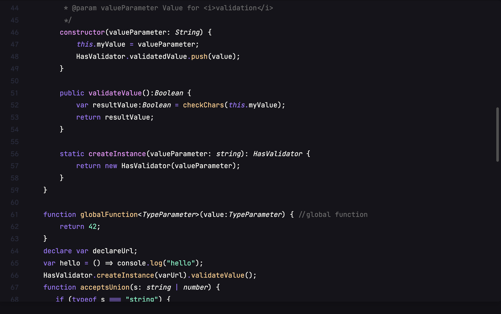

# @codeimage/highlight


[](https://codemirror.net/6/)

> Custom CodeMirror6 editor themes
> for [@codeimage/app](https://github.com/riccardoperra/codeimage/tree/main/apps/codeimage)

CodeImage editor themes are made by the internal `createTheme` api function.

Each theme must implement
the [CustomTheme](./src/lib/core/custom-theme.ts) interface that provides binding for
CodeMirror editor theme and the style for the theme switcher preview.

## How to create a new theme

To create a new theme, you need to run the `generate:theme` command.

```bash
$ pnpm generate:theme
```

It will ask you for a name of for the theme.

> **Warning** Theme name **must be in lower camel case**. \
> ex. githubDark is a valid theme name.

The script will do the following:

- Creates a new folder in the [`src/lib/themes`](./src/lib/themes) folder with the name you used.
- Generate a `index.ts` and `{{yourTheme}}.ts` file in the new folder.
- Automatically add the `export` and `typesVersion` entry in the [package.json](./package.json)

## Available themes

| Feature                                                |        Name        |
| :----------------------------------------------------- | :----------------: |
|                      |      Arc Dark      |
|                    |     Aura Dark      |
|              |    Coldark Cold    |
|              |    Coldark Dark    |
|                        |      Dracula       |
|              |    Duotone Dark    |
|                |    Duotone Sea     |
|                    |     Holi dark      |
|                        |     One Light      |
|          |   Material Light   |
|          |   Material Ocean   |
|  | Material Palenight |
|      |  Material Volcano  |
|                    |     Night Owl      |
|                      |      One Dark      |
|                |    Synthwave 84    |
|                 |    VSCode Dark     |
