# @codeimage/theme

> Custom editor themes for [@codeimage/app](https://github.com/riccardoperra/codeimage/tree/main/apps/codeimage)

CodeImage editor themes are made by the internal `createThemeFactory` api function.

Each theme must implement the [CustomTheme](./src/lib/core/custom-theme.ts) interface that provides binding for
CodeMirror editor theme and the style for the theme switcher preview.

There are two ways of creating themes:

- `createTheme`: themes based on the new @codemirror/highlight api.
- `createPrismJSTheme`: themes that uses the PrismJS token binding class for highlighting.

## Available themes

| Feature                                                |        Name        |
|:-------------------------------------------------------|:------------------:|
| 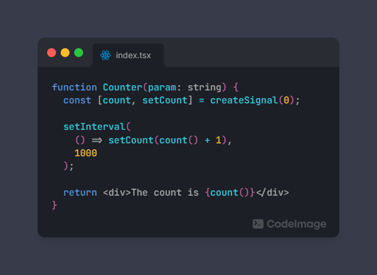                     |      Arc Dark      |
| 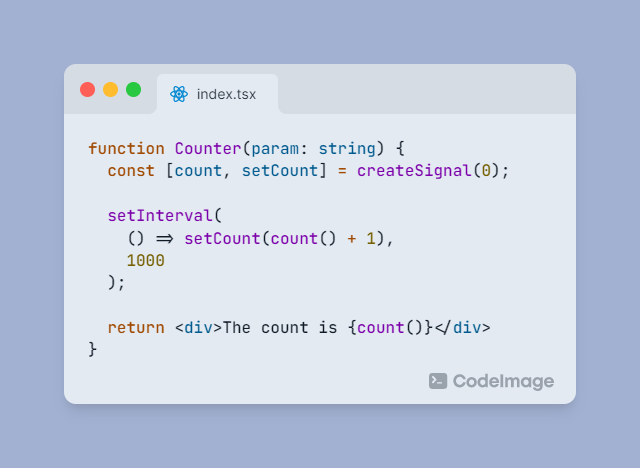             |    Coldark Cold    |
| 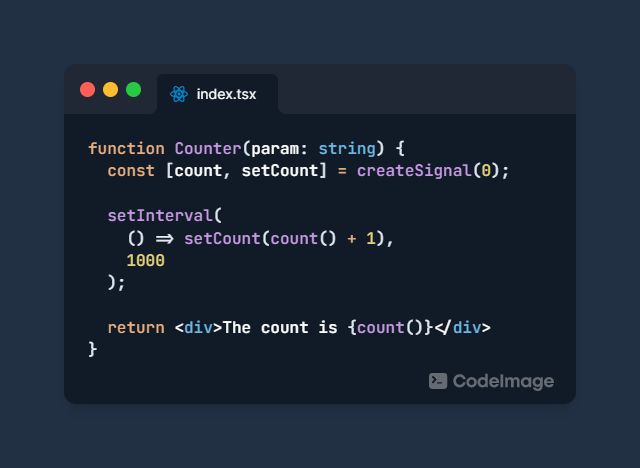             |    Coldark Dark    |
| 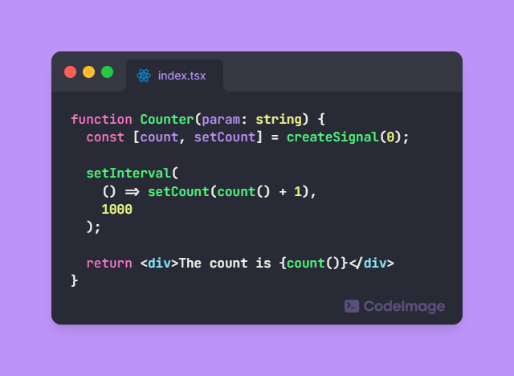                       |      Dracula       |
| 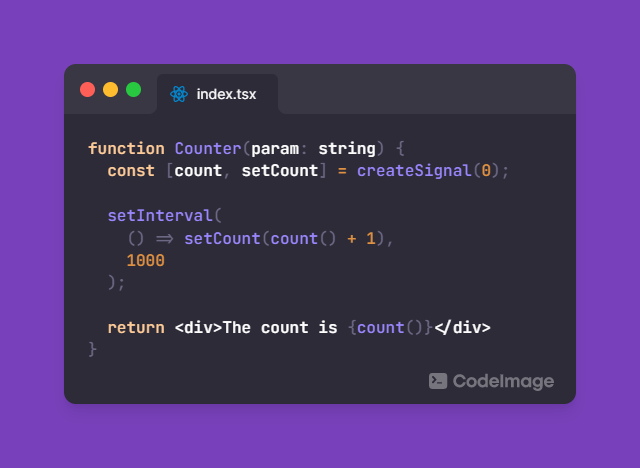             |    Duotone Dark    |
| 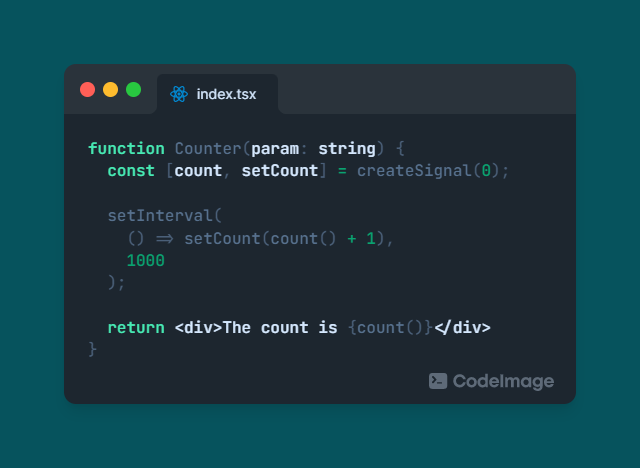               |    Duotone Sea     |
| 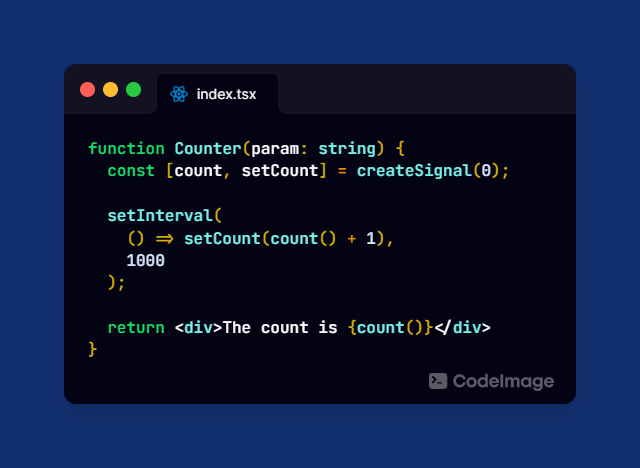                   |     Holi dark      |
| 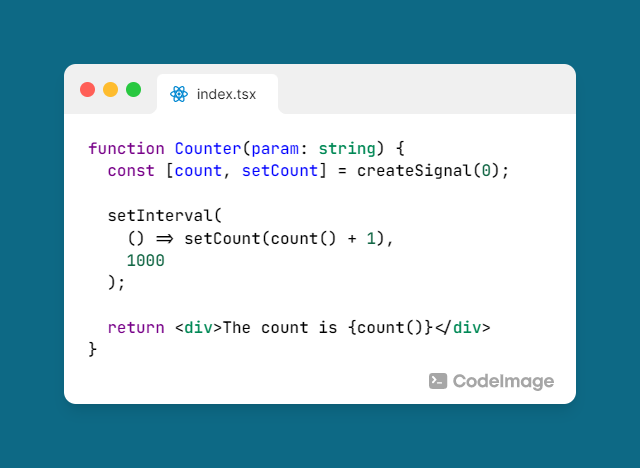                       |     One Light      |
| 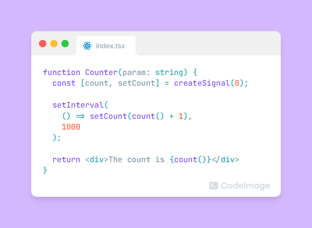         |   Material Light   |
| 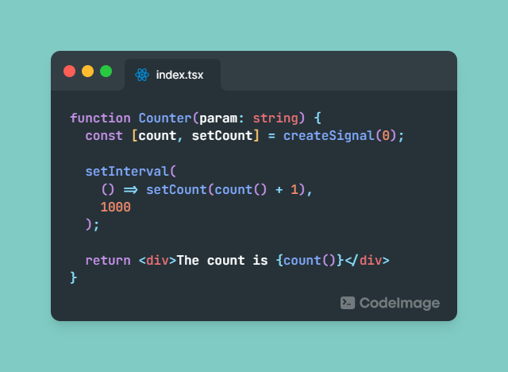         |   Material Ocean   |
| 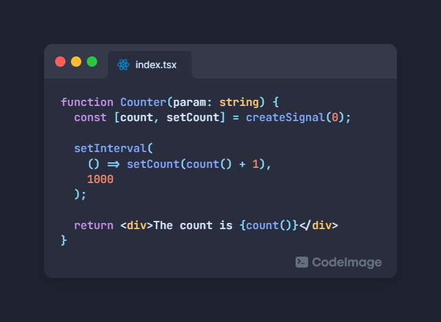 | Material Palenight |
| 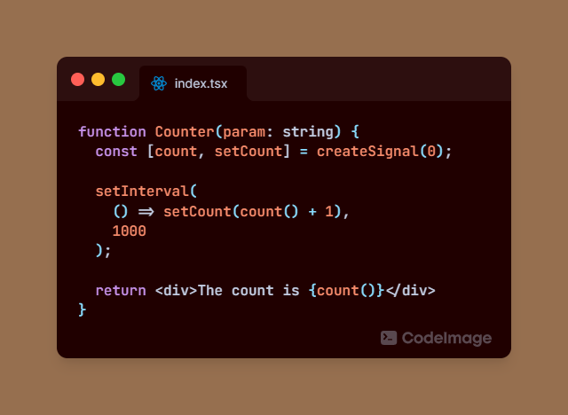     |  Material Volcano  |
| 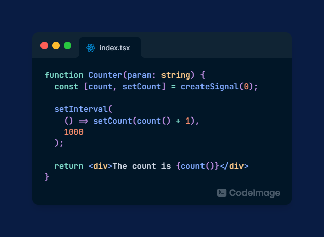                   |     Night Owl      |
| 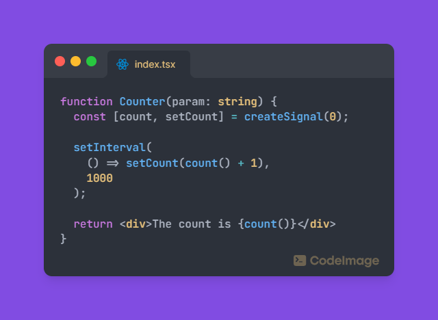                     |      One Dark      |
| 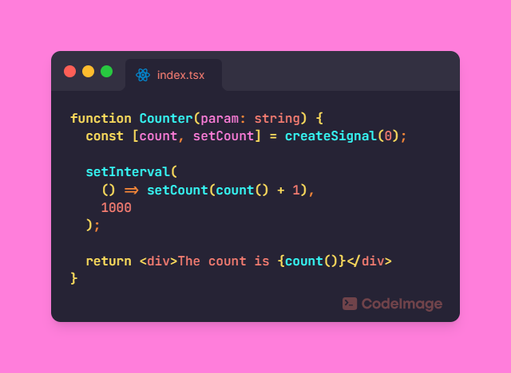               |    Synthwave 84    |
| 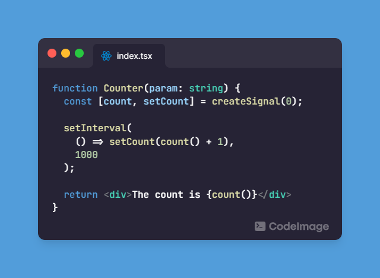                |  VSCode Dark       |

